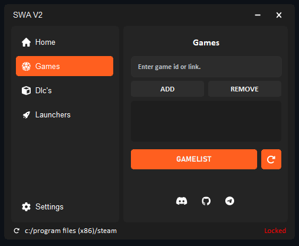

Here's the updated content with the link to PrintedWaste:

---

# SWA v2: Advanced Utility for Steamtools Integration

SWA v2 is an advanced utility designed specifically for integration with [Steamtools](https://steamtools.net), streamlining functionality and enhancing user convenience.

## 📂 Features

- **Over 2500+ Games**: Access a vast library of games, ensuring you have the most up-to-date titles at your fingertips.
- **DLC Support**: Access and manage downloadable content (DLCs) for your games, ensuring a complete and enriched gaming experience.
- **Launcher Bypasses**: Enjoy the ability to bypass supported game launchers.

## 📂 Directories

- **Uploads**: [Access the Uploads Folder](./Uploads) for all application files.

## 📦 Download

Choose the version that suits your needs:

- **SWA v2 Setup**: [Download Installer](./Downloads/SWA_v2_Setup.exe)
- **SWA v2 Portable**: [Download Portable Version](./Downloads/SWA_v2_Portable.zip)

## 🖼️ Screenshots

Here’s a glimpse of the SWA v2 application:

## 💬 Our Socials <3

Stay connected and join the community:

- **Discord**: [Join our server](https://discord.gg/mMxPmzwXHY)
- **Telegram**: [Follow us here](https://t.me/gfklightcloud)

---

### Special Thanks

A special thanks to **[PrintedWaste](https://printedwaste.com/)** for hosting the manifest files.

---

Thank you for using SWA v2! 🚀
