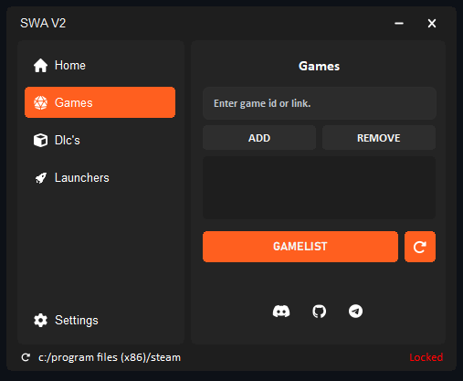

---

# SWA v2: Advanced Utility for Steamtools Integration

SWA v2 is an advanced utility designed specifically for integration with [Steamtools](https://steamtools.net), streamlining functionality and enhancing user convenience.

## 📂 Features

- **Over 3000+ Games**: Access a vast library of games, ensuring you have the most up-to-date titles at your fingertips.
- **DLC Support**: Access and manage downloadable content (DLCs) for your games, ensuring a complete and enriched gaming experience.
- **Launcher Bypasses**: Enjoy the ability to bypass supported game launchers.

## 🎮 Game List
- Explore the full list of available games with over 3000+ titles! [Gamelist](https://printedwaste.com/swa)

## 📂 Directories

- **Uploads**: [Access the Uploads Folder](./Uploads) for all application files.

## 📦 Download

Choose the version that suits your needs:

- **SWA v2 Setup**: [Download Installer](https://raw.githubusercontent.com/LightCloud0/SWAv2/refs/heads/main/Uploads/SWASetup.exe)
- **SWA v2 Portable**: [Download Portable Version](https://raw.githubusercontent.com/LightCloud0/SWAv2/refs/heads/main/Uploads/SWAV2.zip)

## 🖼️ Screenshots

## 💬 Our Socials <3

Stay connected and join the community:

- **Discord**: [Join our server](https://discord.gg/mMxPmzwXHY)
- **Telegram**: [Follow us here](https://t.me/gfklightcloud)

---

## 🤝 Donations

Support of SWA v2 by donating cryptocurrency. Your contributions help us enhance and maintain this project!

- **Bitcoin (BTC)**: `bc1qhsz443as6d3rqqy9h8ur0dm866f26s2854k3gk`
- **Ethereum (ETH)**: `0x8320f72d4e34A0627b7cE9dBA6B3a851bb47ffF7`
- **Tether (USDT)** (TRC-20): `TBU3C1vqdWawhoNr2SxpwghzbNw6ca7vo2`
- **Litecoin (LTC)**: `ltc1qd2zcy3xze40sjwgkw8f34xr6yyz4l96xxkpduy`
- **Dogecoin (DOGE)**: `DQuf6SdUQMfLtjQvvWzGQVJBrNWBAWSKb7`
- **Cardano (ADA)**: `addr1q87kanjzqurfv0q2heddhpfjx4l9zzdlzcun2ae3pd5undwzrlff3z7us3n032yqfn0c9zscl6leyh6fyafks0kwcskqy3esp9`
- **Ripple (XRP)**: `rBwTwhLvp2pr6gYLwhVTL2hRaeC3wY8tYK`
- **Polkadot (DOT)**: `1pTkkdASubn3bKiGQs2zDpuDZ4CiZUFjVU6bDu879HiQo2S`
- **Binance Coin (BNB)**: `0x8320f72d4e34A0627b7cE9dBA6B3a851bb47ffF7`
- **Ton Coin (TON)**: `UQAEFXnUV4by1zg6VEEz-sCIMP-rMT0kZiXFgSWlV9E4LsU5`
- **Solana (SOL)**: `8LosvUWwgUrzFZVenaY4X1vcfoqdnu9whGv1Jp8jbDHE`
- **Polygon (MATIC)**: `0x8320f72d4e34A0627b7cE9dBA6B3a851bb47ffF7`

Your generosity keeps SWA v2 alive. Thank you for supporting us! 💖

---

### Special Thanks

A special thanks to **[PrintedWaste](https://printedwaste.com/)**.

---

Thank you for using SWA v2! 🚀
